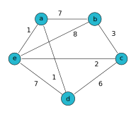

# Example Problems

1. [Deadlines](#deadlines)
2. [Packing](#packing)
3. [Scheduling](#scheduling)
4. [Travel](#travel)

## Deadlines

You are a project manager, and your team has a list of tasks that need to be completed.  Each task takes a specific amount of time to complete and has a deadline by which it must be completed.  Can you figure out which tasks you should prioritize to maximize the number of tasks that can be finished on time?

| Task   | Time to Complete (hours) | Deadline (hour) |
|--------|--------------------------|-----------------|
| Task 1 | 4                        | 5               |
| Task 2 | 3                        | 6               |
| Task 3 | 2                        | 4               |
| Task 4 | 5                        | 9               |
| Task 5 | 1                        | 3               |
| Task 6 | 3                        | 7               |
| Task 7 | 4                        | 8               |
| Task 8 | 2                        | 10              |
| Task 9 | 6                        | 12              |
| Task 10| 5                        | 14              |
| Task 11| 3                        | 6               |
| Task 12| 2                        | 5               |

**What if there are 10000 tasks?**

[Here](examples/deadlines.in) is a list of 10000 tasks. Each line in the file consists of two integers \\(t_i\\) and \\(d_i\\) representing the time to complete and the deadline for the \\(i\\)-th task, respectively.

## Packing

You are going on a long-awaited international vacation. The airline Frowntier has a strict baggage policy: the checked suitcase must not exceed 50 pounds. You spread out 10 items on the floor — clothes, gear, gadgets, and a few luxury comforts. Each item has a weight and a “value,” representing how useful, enjoyable, or important it is for the trip.

You must choose the best combination of items to pack so the total weight stays within 50 pounds, and the total value of the packed items is maximized.

Here’s what’s on the floor:

| Item | Description            | Weight (lbs)  | Value (Importance)   |
|------|------------------------|---------------|----------------------|
| 1    | Jacket                 | 10            | 60                   |
| 2    | DSLR Camera            | 20            | 100                  |
| 3    | Hiking Boots           | 30            | 120                  |
| 4    | Travel First-Aid Kit   | 5             | 30                   |
| 5    | Portable Speaker       | 25            | 90                   |
| 6    | Extra Outfits          | 15            | 70                   |
| 7    | Tablet & Charger       | 40            | 150                  |
| 8    | Snacks                 | 3             | 20                   |
| 9    | Toiletries Kit         | 12            | 65                   |
| 10   | Travel Pillow          | 7             | 40                   |

What is the maximum value of items you can pack?

**What if there are 100 items?**

[Here](examples/packing.in) is a list of 100 items.  Each line in the file consists of two integers \\(w_i\\) and \\(v_i\\) representing the weight and value of the \\(i\\)-th item, respectively.

## Scheduling

You have a project with 8 tasks, and some tasks depend on others to be completed first.  Each day you can run as many tasks as possible simultaneously, as long as their dependencies are met.

**Tasks**

- Task A: No dependencies (can start immediately).
- Task B: No dependencies (can start immediately).
- Task C: No dependencies (can start immediately).
- Task D: Depends on Task A, Task B, and Task C.
- Task E: Depends on Task B and Task C.
- Task F: Depends on Task D and Task E.
- Task G: Depends on Task D and Task F.
- Task H: Depends on Task E, Task F, and Task G.

How many days does it take you to complete the project?

**What if there are 10000 tasks?**

[Here](examples/scheduling.in) is a list of 10000 tasks.  Each line in the file consists of two tasks \\(u_i\\) and \\(v_i\\) indicating task \\(v_i\\) depends on task \\(u_i\\).

## Travel

You are tasked with finding the shortest route to travel through all 5 cities, visiting each exactly once and returning to City 1. 

How to minimize the total distance traveled?

**What if there are 20 cities?**

[Here](examples/travel.in) is a list of distances between the 20 cities.  Each line consists of three integers \\(u_i\\), \\(v_i\\), and \\(d_i\\) indicating the distance between \\(u_i\\) and \\(v_i\\) is \\(d_i\\).
